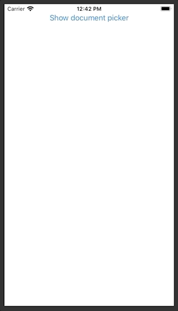

**NewComponent** is a _SwiftUI_ view for…



# Example

```swift
struct ContentView: View {

  var body: some View {
    NewComponent()
  }
}
```

For more please check the [documentation folder](doc).

# Installation via SPM

In _XCode_ add the following URL to your project's _Swift Package_ dependencies:

 `https://github.com/swiftuilib/new-component`
